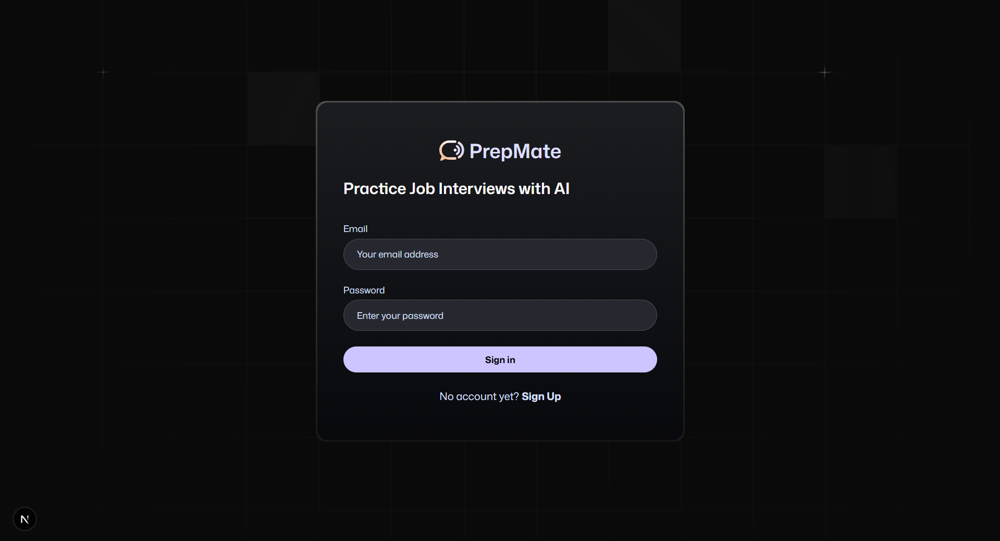
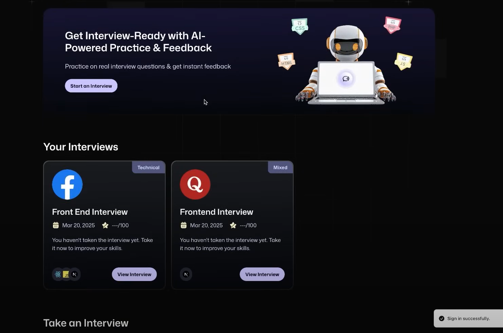
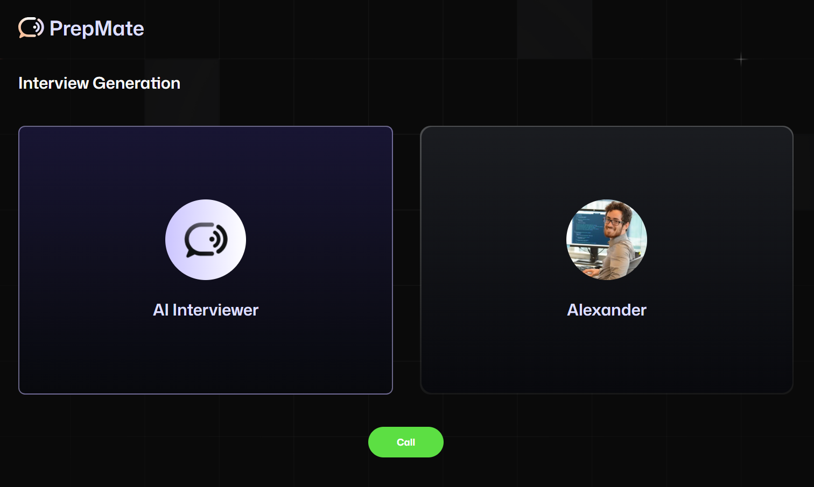
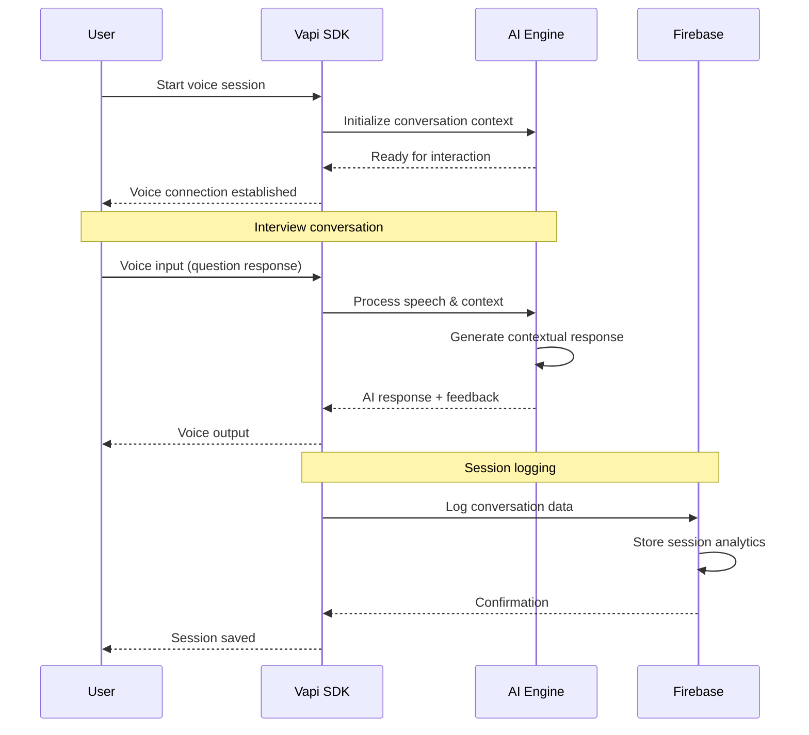

<div align="left">
  <div style="display: inline-block;">
    <h1 style="display: inline-block; vertical-align: middle; margin-top: 0;">
       AI Agent Interview Assistant
    </h1>
    
    <p><em>The future of interview preparation is here. Speak. Practice. Dominate.</em></p>
    <p>
      
  
  
  
    </p>
    <p style="margin:4px 0; white-space: nowrap;">
  Built with:&nbsp;
  <br>

<p align="center">
  
</p>

<table align="center">
<tr>
<td align="center"><br><b>React Framework</b></td>
<td align="center"><br><b>Voice AI</b></td>
<td align="center"><br><b>Backend</b></td>
<td align="center"><br><b>Type Safety</b></td>
</tr>
<tr>
<td align="center"><br><b>Styling</b></td>
<td align="center"><br><b>Database</b></td>
<td align="center"><br><b>Components</b></td>
<td align="center"><br><b>Deployment</b></td>
</tr>
</table>
</p>

  </div>
</div>

<br clear="left"/>

---

<details><summary>📜 Table of Contents</summary>

- [📖 Overview](#-overview)
- [📸 UI Screenshots](#-ui-screenshots)
- [✨ Features](#-features)
- [🛠️ Tech Stack](#%EF%B8%8F-tech-stack)
- [🚀 Quick Start](#-quick-start)
- [📁 Project Architecture](#-project-architecture)
- [🔐 Voice AI Integration](#-voice-ai-integration)
- [🎮 Usage Examples](#-usage-examples)
- [🔮 Roadmap & Future Vision](#-roadmap--future-vision)
- [🤝 Join Our Community](#-join-our-community)
- [📄 License & Credits](#-license--credits)

</details>

---

## 📖 Overview

**AI-Agent Interview Assistant** revolutionizes interview preparation with intelligent voice-powered conversations. Designed for modern professionals, it combines cutting-edge AI technology with intuitive user experience. Whether you're preparing for frontend, backend, data science, or product management roles, this platform provides realistic interview simulations to accelerate your career growth.

### 🌟 Why Choose AI-Agent Interview Assistant?

- **🎤 Natural Voice Interaction** — Realistic spoken conversations with advanced AI
- **🧠 Context-Aware AI** — Intelligent responses that adapt to your experience level
- **⚡ Real-Time Processing** — Zero-latency voice streaming for natural dialogue
- **🌐 Cloud-Ready** — Scalable Next.js architecture with Firebase integration
- **📱 Mobile-First** — Responsive design that works perfectly on any device
- **🔄 Session Management** — Automatic conversation logging and progress tracking
- **🎯 Role-Specific Training** — Specialized interview scenarios for different positions

---

## 📸 UI Screenshots

<div align="center">
  
  
  
</div>

<div align="center">
  <em>🔐 Secure Login • 📋 Intuitive Dashboard • 🤖 AI Conversations</em>
</div>

---

## ✨ Features

<table>
<tr>
<td width="50%">

### 🎤 **Advanced Voice Technology**

- **Real-Time Voice Streaming** with Vapi SDK integration
- **Natural Language Processing** for context understanding
- **Voice Activity Detection** for seamless conversations
- **Multi-Language Support** for global accessibility
- **Audio Quality Optimization** for crystal-clear communication
- **Background Noise Suppression** for focused sessions

</td>
<td width="50%">

### 🧠 **Intelligent AI System**

- **Context-Aware Responses** that remember conversation history
- **Adaptive Question Difficulty** based on performance
- **Industry-Specific Knowledge** for targeted preparation
- **Personalized Feedback** with actionable insights
- **Performance Analytics** tracking improvement over time
- **Dynamic Interview Scenarios** for varied practice

</td>
</tr>
<tr>
<td width="50%">

### 📊 **Comprehensive Analytics**

- **Session Recording** with complete conversation logs
- **Performance Metrics** tracking response quality
- **Progress Visualization** with detailed charts
- **Skill Gap Analysis** identifying improvement areas
- **Interview History** with searchable transcripts
- **Export Capabilities** in multiple formats

</td>
<td width="50%">

### ⚡ **Performance Optimized**

- **Next.js Framework** for optimal loading speeds
- **Firebase Integration** for scalable data storage
- **Real-Time Synchronization** across devices
- **Optimistic Updates** for instant user feedback
- **Caching Strategies** for improved performance
- **Progressive Enhancement** for all browsers

</td>
</tr>
</table>

---

## 🛠️ Tech Stack

<div align="center">

|                                                     Technology                                                      |     Purpose     |                  Why We Chose It                   |
| :-----------------------------------------------------------------------------------------------------------------: | :-------------: | :------------------------------------------------: |
|                  |  **Frontend Framework**   | Server-side rendering & optimal performance  |
|       | **Type Safety** | Enhanced developer experience & code reliability  |
|                   | **Voice AI** | Advanced voice streaming & natural conversations |
|             |   **Backend & Database**   | Real-time data sync & scalable infrastructure  |
|   | **Styling**  |   Utility-first approach & rapid UI development   |
|  |   **Deployment**   |     Seamless deployment & global CDN distribution     |

</div>

---

## 🚀 Quick Start

Get your AI-powered interview assistant running in under 5 minutes:

### Prerequisites

- **Node.js 16+** (Latest LTS recommended)
- **npm** or **yarn** package manager
- **Vapi.ai account** for voice functionality
- **Firebase project** for data storage
- **Modern browser** with microphone access

### Installation

```bash
# Clone the repository
git clone https://github.com/AlexanderPotiagalov/AI-Agent-Interview-Assistant.git
cd AI-Agent-Interview-Assistant

# Install dependencies
npm install
```

### Environment Setup

Create `.env.local` in the root directory:

```env
# Vapi Voice AI Configuration
NEXT_PUBLIC_VAPI_API_KEY=your_vapi_api_key_here

# Firebase Configuration
NEXT_PUBLIC_FIREBASE_API_KEY=your_firebase_api_key
NEXT_PUBLIC_FIREBASE_PROJECT_ID=your_project_id
NEXT_PUBLIC_FIREBASE_APP_ID=your_app_id
NEXT_PUBLIC_FIREBASE_AUTH_DOMAIN=your_project_id.firebaseapp.com
NEXT_PUBLIC_FIREBASE_STORAGE_BUCKET=your_project_id.appspot.com
NEXT_PUBLIC_FIREBASE_MESSAGING_SENDER_ID=your_sender_id

# Application Configuration
NEXT_PUBLIC_APP_URL=http://localhost:3000
```

### Launch the Application

```bash
# Start development server
npm run dev
```

🎉 **Success!** Navigate to `http://localhost:3000` and start your interview preparation!

### Getting API Keys

**Vapi Setup:**
1. Visit [Vapi.ai](https://vapi.ai) and create an account
2. Navigate to your dashboard
3. Generate and copy your public API key

**Firebase Setup:**
1. Go to [Firebase Console](https://console.firebase.google.com)
2. Create a new project
3. Enable Firestore Database
4. Get your configuration from Project Settings

---

## 📁 Project Architecture

Our architecture follows modern best practices for scalability and maintainability:

```
AI-Agent-Interview-Assistant/
├── components/
│   ├── AgentCard.tsx           # AI agent interface component
│   ├── CallControls.tsx        # Voice call management controls
│   ├── Dashboard.tsx           # Analytics dashboard
│   ├── InterviewSettings.tsx   # Interview configuration
│   └── SessionHistory.tsx      # Past interview sessions
├── integrations/
│   ├── vapi.ts                 # Vapi SDK configuration
│   └── firebase.ts             # Firebase setup and utilities
├── pages/
│   ├── index.tsx               # Main application entry point
│   ├── dashboard.tsx           # Analytics and progress page
│   ├── settings.tsx            # User preferences
│   └── api/
│       ├── sessions.ts         # Session management API
│       └── analytics.ts        # Performance analytics API
├── utils/
│   ├── firebase.ts             # Firebase helper functions
│   ├── analytics.ts            # Session tracking utilities
│   ├── audioUtils.ts           # Audio processing helpers
│   └── constants.ts            # Application constants
├── styles/
│   ├── globals.css             # Global styling
│   └── components.css          # Component-specific styles
├── public/
│   ├── preview.png             # Application screenshots
│   └── icons/                  # Application icons
└── README.md
```

---

## 🔐 Voice AI Integration

Our voice AI system provides natural, intelligent conversations:



### Voice AI Features

- **Real-Time Processing** with sub-200ms latency
- **Context Retention** throughout entire sessions
- **Adaptive Responses** based on user performance
- **Natural Speech Patterns** for realistic conversations
- **Background Processing** for seamless experience
- **Quality Monitoring** with automatic adjustments

---

## 🎮 Usage Examples

### Voice Session Management

```javascript
// Initialize Vapi client
import { VapiClient } from '@vapi-ai/web';

const vapi = new VapiClient({
  apiKey: process.env.NEXT_PUBLIC_VAPI_API_KEY,
});

// Start interview session
const startInterview = async (interviewType) => {
  try {
    await vapi.start({
      assistant: {
        name: "Interview Assistant",
        voice: "alloy",
        model: "gpt-4",
        instructions: `You are conducting a ${interviewType} interview...`,
      },
    });
  } catch (error) {
    console.error("Failed to start interview:", error);
  }
};

// Handle conversation events
vapi.on('call-start', () => {
  console.log('Interview session started');
  logSessionStart();
});

vapi.on('speech-start', () => {
  setIsUserSpeaking(true);
});

vapi.on('message', (message) => {
  logConversationMessage(message);
  updateSessionAnalytics(message);
});
```

### Firebase Integration

```javascript
// Session logging
import { collection, addDoc, serverTimestamp } from 'firebase/firestore';
import { db } from '../utils/firebase';

const logInterviewSession = async (sessionData) => {
  try {
    await addDoc(collection(db, 'sessions'), {
      ...sessionData,
      timestamp: serverTimestamp(),
      userId: getCurrentUserId(),
    });
  } catch (error) {
    console.error('Error logging session:', error);
  }
};

// Real-time analytics
const [sessions, setSessions] = useState([]);

useEffect(() => {
  const unsubscribe = onSnapshot(
    collection(db, 'sessions'),
    (snapshot) => {
      const sessionData = snapshot.docs.map(doc => ({
        id: doc.id,
        ...doc.data()
      }));
      setSessions(sessionData);
    }
  );

  return unsubscribe;
}, []);
```

### Interview Type Configuration

```javascript
// Interview specializations
const interviewTypes = {
  frontend: {
    name: "Frontend Development",
    topics: ["React", "JavaScript", "CSS", "Performance"],
    difficulty: "intermediate",
    duration: 30
  },
  backend: {
    name: "Backend Engineering", 
    topics: ["APIs", "Databases", "System Design", "Security"],
    difficulty: "advanced",
    duration: 45
  },
  dataScience: {
    name: "Data Science",
    topics: ["Machine Learning", "Statistics", "Python", "SQL"],
    difficulty: "advanced", 
    duration: 40
  }
};

// Dynamic interview setup
const configureInterview = (type, userLevel) => {
  const config = interviewTypes[type];
  return {
    ...config,
    difficulty: adjustDifficulty(config.difficulty, userLevel),
    customPrompts: generatePrompts(config.topics, userLevel)
  };
};
```

---

## 🔮 Roadmap & Future Vision

We're focused on delivering cutting-edge features to revolutionize interview preparation:

- 🌙 **Dark Mode Interface** — Sleek UI with automatic theme switching
- 🔍 **Advanced Analytics** — Deep insights into performance patterns
- 📁 **Custom Interview Templates** — Create personalized interview scenarios
- 📊 **Progress Tracking** — Visual progress charts and milestone achievements
- 🤝 **Multi-User Sessions** — Practice with peers and mentors
- 📱 **Mobile App** — Native iOS and Android applications
- 🌐 **Multi-Language Support** — Interview preparation in multiple languages
- 🎯 **Company-Specific Prep** — Tailored questions for target companies
- 🤖 **AI Feedback Engine** — Detailed analysis and improvement suggestions
- 📧 **Smart Notifications** — Personalized practice reminders and tips

---

## 🤝 Join Our Community

Great software is built by passionate communities. Join us in revolutionizing interview preparation:

<div align="center">

### 💬 **Get Involved**

[](https://github.com/AlexanderPotiagalov/AI-Agent-Interview-Assistant/discussions)
[](https://github.com/AlexanderPotiagalov/AI-Agent-Interview-Assistant/issues)
[](https://github.com/AlexanderPotiagalov/AI-Agent-Interview-Assistant/pulls)

</div>

### Ways to Contribute

- 🐛 **Bug Reports** — Help us identify and fix issues quickly
- 💡 **Feature Requests** — Share your ideas for new functionality
- 🔧 **Code Contributions** — Submit pull requests for improvements
- 📚 **Documentation** — Improve guides, tutorials, and API docs
- 🎨 **Design & UX** — Enhance UI/UX and create marketing assets
- 🗣️ **Community Support** — Help other users in discussions
- 🎓 **Educational Content** — Create tutorials and best practices guides
- 🔍 **Testing** — Help test new features and report feedback
- 🌍 **Interview Questions** — Contribute industry-specific questions

### Development Guidelines

```bash
# Fork the repository
git clone https://github.com/yourusername/AI-Agent-Interview-Assistant.git
cd AI-Agent-Interview-Assistant

# Create feature branch
git checkout -b feature/amazing-feature

# Make your changes
npm run test          # Run tests
npm run lint          # Check code style
npm run type-check    # Verify TypeScript

# Commit with conventional commits
git commit -m "feat: add amazing new feature"

# Push and create PR
git push origin feature/amazing-feature
```

---

## 📄 License & Credits

<div align="center">

**AI-Agent Interview Assistant** is open source and available under the [MIT License](LICENSE).

Built with cutting-edge voice AI technology and a commitment to helping professionals succeed.

---

### 👨‍💻 **Created with ❤️ by [Alexander Potiagalov](https://github.com/AlexanderPotiagalov)**

_Empowering careers, one interview at a time._

---

<p>
  
  
  
  
</p>

**⭐ Star this repo if you found it helpful!**
</div>
